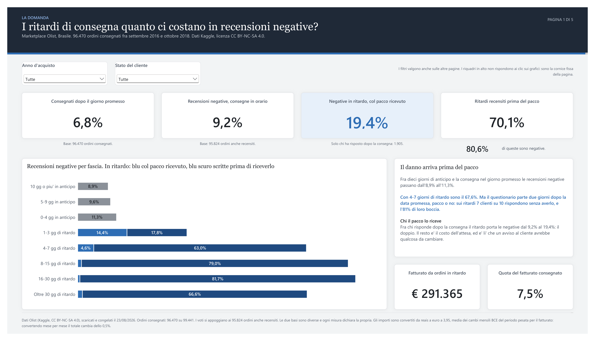
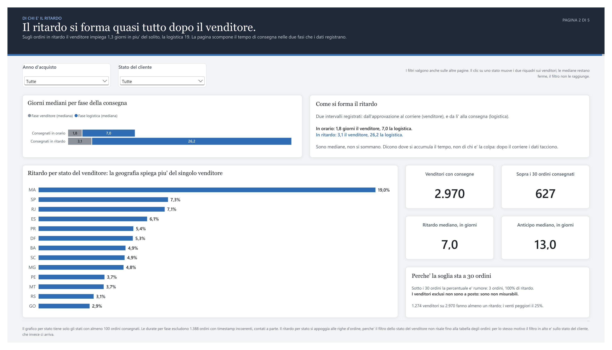
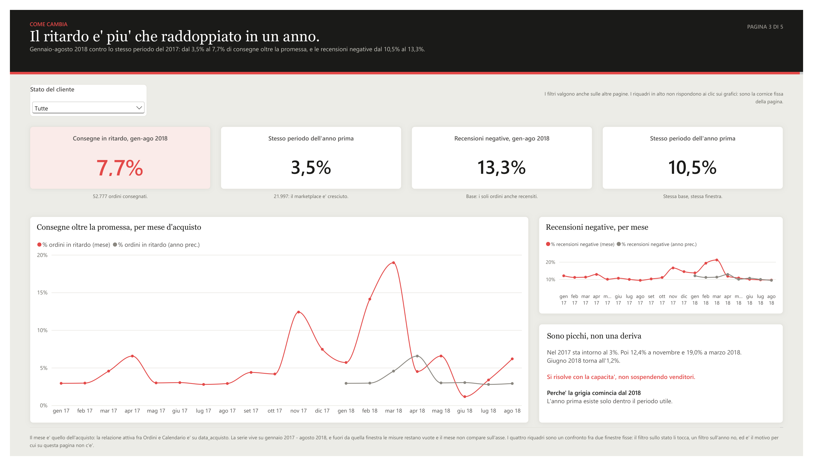
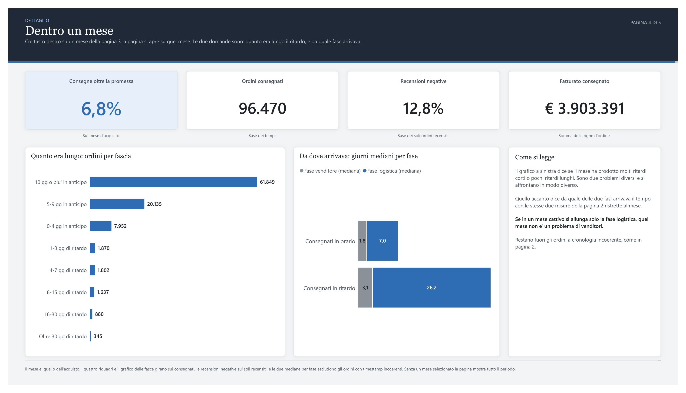
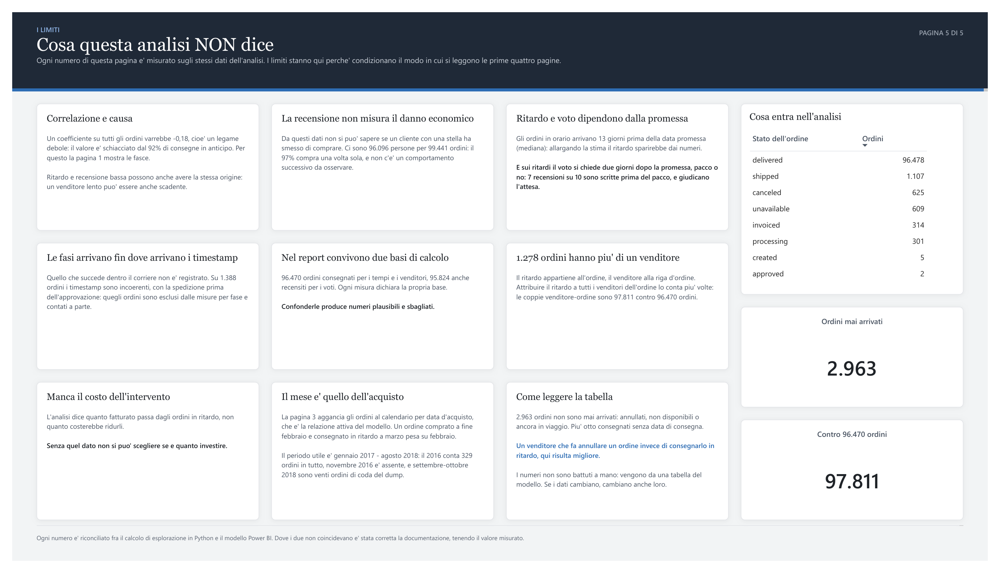
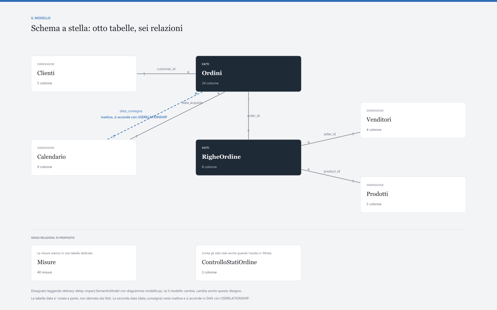

# I ritardi di consegna quanto costano in recensioni negative

Analisi in Power BI sul marketplace brasiliano Olist: 96.470 ordini consegnati fra
settembre 2016 e ottobre 2018. I dati sono il dump pubblico che Olist ha rilasciato su
Kaggle, licenza CC BY-NC-SA 4.0, e non sono nel repository: come scaricarli sta più sotto.

La domanda è stata scritta prima di aprire Power BI, in `DOMANDA.md`, e il cruscotto
risponde a quella e a nient'altro.

---

## Cosa dicono i dati

**Il danno arriva prima del pacco.** Il 6,8% degli ordini arriva dopo il giorno promesso.
Su quegli ordini il questionario non aspetta la consegna: nei dati parte due giorni dopo la
data promessa, e **7 clienti su 10 rispondono prima di avere il pacco. L'81% di loro
boccia.**

**Chi il pacco lo riceve in ritardo boccia il doppio.** Fra chi risponde dopo la consegna,
le recensioni negative passano dal 9,2% (in orario) al **19,4%**. Il confronto regge anche
dentro la stessa fascia: chi riceve il pacco con 1-3 giorni di ritardo, che sono tre su
quattro di questo gruppo, boccia nel **18,6%** dei casi; con 4-7 giorni nel 20,3%. E il
divario resta uguale confrontando ordini dello stesso stato o dello stesso mese. È il
danno della consegna; il resto è il danno dell'attesa, ed è lì che avvisare il cliente
prima della data promessa avrebbe qualcosa da cambiare.

**Il legame non è una pendenza, è un dirupo.** Fra dieci giorni di anticipo e la consegna
nel giorno promesso le recensioni negative passano dall'8,9% all'11,3%. Fra 4 e 7 giorni
di ritardo sono il 67,6%, quasi tutte scritte prima del pacco. Un coefficiente di
correlazione su tutti gli ordini varrebbe −0,18, cioè «legame debole»: è schiacciato dal
92% di consegne in anticipo. Per questo nel cruscotto non c'è nessuna correlazione, ci
sono le fasce.

**Il ritardo si accumula nella fase di trasporto.** Spezzando il tempo di consegna nei due
intervalli che i dati registrano: sugli ordini in ritardo la fase del venditore dura 1,3
giorni in più del solito, quella dopo l'affidamento al corriere 19 (mediane). È una
descrizione di dove si accumula il tempo, non una sentenza. E non c'è una manciata di
venditori anomali: i venti con più ritardi ne fanno il 25%, ma gestiscono anche il 20%
degli ordini, con un tasso di ritardo dell'8% contro il 6,7% di tutti.

**Sta peggiorando, a picchi.** Gennaio-agosto 2018 contro lo stesso periodo 2017: dal 3,5%
al 7,7% di consegne oltre la promessa. Ma per quasi tutto il 2017 il ritardo sta intorno al
3%, poi novembre 2017 fa 12,4% e marzo 2018 fa 19,0%, e giugno 2018 torna all'1,2%.

Messe insieme, le ultime due suggeriscono un'ipotesi da verificare con chi gestisce le
spedizioni: un problema di capacità nei mesi di punta, più che venditori da sospendere.

Le correzioni dopo la pubblicazione, con i numeri di prima, stanno in `CHANGELOG.md`.

---

## Le pagine











La quarta pagina si apre anche col tasto destro su un mese del grafico della terza, e mostra
per quel mese quanto era lungo il ritardo e da quale delle due fasi arrivava. Passando il
mouse su una fascia della prima pagina si apre un riquadro con gli ordini, il voto e il
fatturato di quella fascia.

L'ultima pagina non è un'appendice: è stata progettata insieme alle altre, prima di
costruirle. Elenca cosa l'analisi non può dire, che la recensione misura la
percezione e non il danno, che «in ritardo» è rispetto a una promessa e non a un tempo
ragionevole, che manca il costo di rimediare e quindi il cruscotto informa chi decide ma
non decide.

---

## Il modello



Schema a stella: due tabelle dei fatti a grana diversa (l'ordine e la riga d'ordine),
quattro dimensioni, una tabella di sole misure e una tabella di controllo con il conteggio
degli stati dell'ordine.

Le decisioni che sono costate qualcosa:

- **Il fatturato sta nelle righe, il ritardo sta negli ordini.** Ogni misura dichiara da
  quale delle due scende, altrimenti «fatturato degli ordini in ritardo» è ambiguo.
- **Le recensioni non sono una tabella.** 547 ordini hanno più di una recensione e 789
  `review_id` compaiono su più ordini: la chiave dichiarata non è una chiave. Il voto per
  ordine è una media, calcolata in Power Query. Il prezzo è misurato: la media delle medie
  vale 4,1562 contro 4,1557 delle recensioni una per una, cioè 0,0005.
- **Il calendario è creato, non derivato** da una colonna dei fatti, e contrassegnato come
  tabella data. Serve perché novembre 2016 non ha nessun ordine: un calendario derivato
  salterebbe quel mese e l'intelligenza temporale sbaglierebbe in silenzio.
- **Due basi convivono:** 96.470 ordini consegnati per i tempi, 95.824 anche recensiti per
  i voti. Ogni misura dice quale usa. Confonderle produce numeri plausibili e sbagliati.
- **Soglie dichiarate:** un venditore sotto i 30 ordini consegnati non entra nei conteggi
  per venditore, uno stato sotto i 100 non entra nel grafico per stato. Non sono «a posto»:
  sono non misurabili.
- **Gli importi sono in euro**, convertiti dai reais alla media dei cambi mensili BCE del
  periodo pesata per il fatturato. Il tasso è una costante nel modello (3,95), con il
  calcolo che la giustifica nel commento dello script. Convertire mese per mese sposterebbe il totale dello 0,02%; usare il cambio
  di un anno solo lo sposterebbe del 9%.

---

## Com'è costruito

Il progetto è in formato `.pbip`, quindi modello e report sono file di testo sotto
controllo di versione. Nessuno dei due è disegnato a mano:

| File | Cosa fa |
|---|---|
| `power-query/*.m` | le query, una per tabella, con i controlli di riga attesi nei commenti |
| `costruisci-modello.ps1` | monta tabelle, relazioni e 40 misure DAX e scrive il TMDL |
| `costruisci-report.py` | scrive le pagine in PBIR, un JSON per visuale: quattro pagine, una di dettaglio e un riquadro al mouse |
| `verifica-tela.py` | otto controlli sulla tela, senza aprire Power BI |
| `diagramma-modello.py` | disegna il diagramma leggendo il TMDL, non fotografando lo schermo |

`verifica-tela.py` controlla che ogni misura e ogni colonna citata esista, che niente esca
dalla tela o si sovrapponga, che tutto stia sulla griglia a dodici colonne, che il testo e
i numeri ci stiano nelle loro caselle (Power BI il testo di troppo non lo taglia: ci mette
una barra di scorrimento) e che nessuna misura del modello giri a vuoto.

Il diagramma è disegnato dal TMDL invece che catturato dalla vista Modello: se il modello
cambia, il disegno cambia con lui.

**Il progetto è stato costruito con l'aiuto di un assistente IA.** Le scelte che contano (la
domanda, le soglie dichiarate, le due tabelle che nel modello non sono entrate, il tasso
di cambio a cui sono convertiti gli importi) sono scritte con il loro perché in
`DOMANDA.md` e nei commenti degli script. Una scelta che non si sa spiegare non serve a
niente, e questa è la ragione per cui sono scritte tutte.

---

## Rifarlo

I dati non sono nel repository: sono il dump pubblico
[Brazilian E-Commerce di Olist](https://www.kaggle.com/datasets/olistbr/brazilian-ecommerce)
su Kaggle, licenza CC BY-NC-SA 4.0, 164 MB. Vanno scaricati e scompattati in
`dati_grezzi/csv/`. Il percorso non va toccato: `costruisci-modello.ps1` lo prende dalla
cartella in cui si trova il progetto, e lo scrive in `PercorsoDati`.

```
powershell -ExecutionPolicy Bypass -File costruisci-modello.ps1
python costruisci-report.py
python verifica-tela.py
```

Poi si apre `delivery-delay-impact.pbip` con Power BI Desktop e si aggiornano i dati.
Il modello viene riletto dallo script stesso appena scritto, così un errore di formato si
vede lì e non aprendo il file.

---

## I documenti

Il lavoro è documentato mentre si faceva, non dopo:

| File | Cosa contiene |
|---|---|
| `DOMANDA.md` | la domanda e le sei sotto-domande, scritte prima di aprire Power BI, poi verificate una per una sui dati |
| `DATI-SPORCHI.md` | i problemi trovati esplorando i CSV, con il passaggio di Power Query che li tratta |
| `CHANGELOG.md` | le correzioni dopo la pubblicazione: cosa diceva prima, perché era sbagliato, cosa dice adesso |
| `RICONCILIAZIONE.md` | i numeri che il modello deve riprodurre, e il loro esito |

Il criterio in `RICONCILIAZIONE.md`: se il cruscotto e i documenti dicono numeri diversi,
mentono i documenti. Ogni scarto trovato è stato risolto correggendo il documento e
tenendo il valore misurato dal motore.

---

Dati Olist (Kaggle, CC BY-NC-SA 4.0), scaricati e congelati il 23 agosto 2026.
Cambi BCE, serie `EXR.M.BRL.EUR.SP00.A`.
